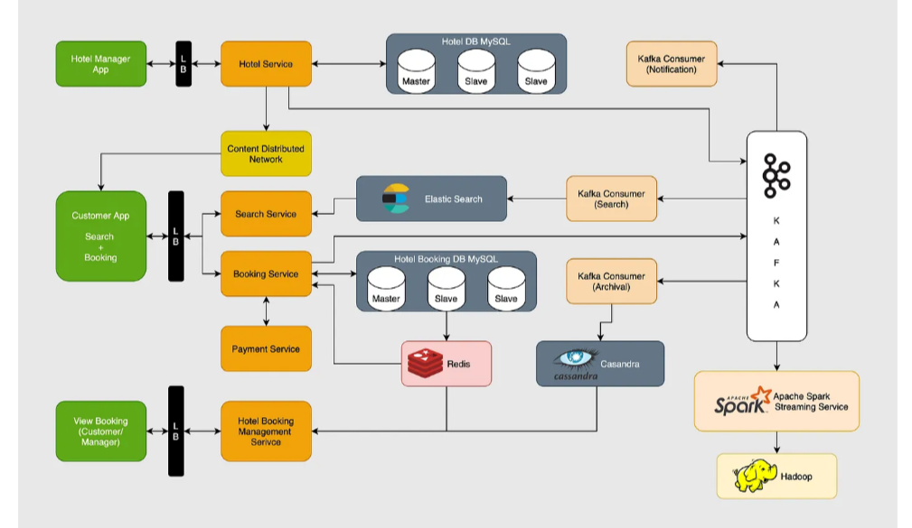

# Requirement Analysis in Software Development

## Introduction

Welcome to the **Requirement Analysis in Software Development** repository!  

This repository is dedicated to exploring the critical phase of **requirement analysis** in the software development lifecycle. Here, we aim to analyze, document, and understand the requirements of a software project, which serves as the foundation for successful development.  

### Purpose
- Provide insights into the process of gathering and analyzing requirements.
- Highlight the importance of clear and well-documented requirements in delivering high-quality software.
- Serve as a structured resource for understanding and implementing requirement analysis techniques.

---

## What is Requirement Analysis?

**Requirement Analysis** is the process of identifying, documenting, and managing the needs and expectations of stakeholders for a software product. It serves as the foundation of the **Software Development Lifecycle (SDLC)** by ensuring that all parties involved have a clear understanding of the goals and functionality of the system being developed.  

---

## Why is Requirement Analysis Important?

Requirement Analysis is a cornerstone of successful software development. Below are three key reasons why it is critical in the SDLC:

1. **Prevents Miscommunication**  
   Miscommunication between stakeholders and the development team can lead to incorrect or incomplete implementations. Requirement analysis bridges this gap by ensuring that all requirements are well-documented, agreed upon, and clearly communicated.

2. **Reduces Development Costs**  
   Identifying potential issues or conflicts in the early stages of development is far less expensive than addressing them during or after implementation. Requirement analysis minimizes the risk of costly rework by detecting and addressing problems before development begins.

3. **Ensures Project Success**  
   By aligning the software's functionality with the stakeholders' needs and the business goals, requirement analysis increases the likelihood of delivering a successful project. It establishes a clear roadmap, ensuring that the development process is efficient and focused.

---

## Key Activities in Requirement Analysis

- **Requirement Gathering**  
  Collecting initial information about the project by engaging with stakeholders, reviewing existing systems, and understanding business goals. 

- **Requirement Elicitation**  
  Engaging with stakeholders to uncover their explicit and implicit requirements using interviews, surveys, and workshops.

- **Requirement Documentation**  
  Creating a structured record of the requirements, including functional and non-functional requirements.

- **Requirement Analysis and Modeling**  
  Analyzing and modeling requirements using techniques like flowcharts, UML diagrams, and wireframes.

- **Requirement Validation**  
  Ensuring that the documented requirements accurately reflect the stakeholders' needs.

---

## Use Case Diagrams

**Use Case Diagrams** are a type of UML diagram used to visually represent the interactions between users (actors) and the system. These diagrams help identify the functionality the system must support and provide clarity on user roles and system goals.

### Benefits of Use Case Diagrams:
- Clearly outline system functionality.
- Identify interactions between different users and the system.
- Serve as a communication tool between stakeholders and developers.
- Help in defining the system's scope and functionality.

### Example: Use Case Diagram for a Booking System

The use case diagram below illustrates a booking system with two main actors: **Customer** and **Admin**. Key use cases include **Search Rooms**, **Make Reservation**, **Cancel Booking**, and **Manage Rooms**.

---

